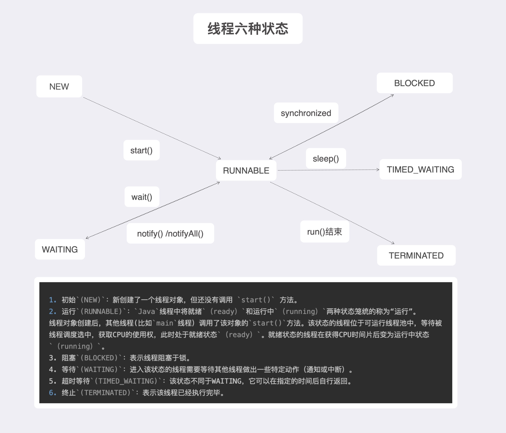

## 线程的六种状态

- `NEW(新建)` 指新创建了一个线程对象，还未调用 `start()` 方法。              
- `RUNNABLE(运行)` 指运行， Java 中将`ready` 和 `running` 统称为运行。调用 `start()` 后线程位于可运行池中，等待线程调度选中，获取`CPU`使用权，此时处于就绪状态。就绪状态的线程获取到`CPU`后变为运行状态。      
- `BLOCKED(锁池)` 指线程阻塞，阻塞的方法有多种，调用 `sleep()` 或者别的线程执行了 `join()` 方法。    
- `TIMED_WAITING(定时等待)` 指定时间等待后自行返回，调用方法 `wait()`，该状态不同于`WAITING`。    
- `WAITING(等待)`、 指进入该等待动作需要等待其他线程做出特定操作。（类似 `notify(), notifyAll()`)。    
- `TERMINATED(终止、结束)` 指线程已经执行完毕。

