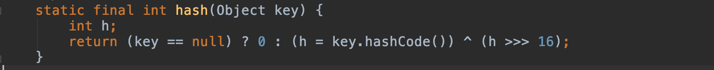
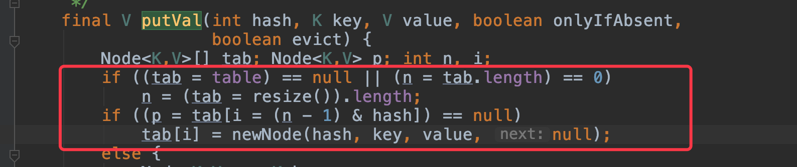

## Java 运算符与（&），或（|），非（~），异或（^） 

### 1、阅读HashMap(1.8)的源码时，遇到了关于运算符的相关操作，所以在此整理一下。

第一步：取key的hash值 与 位移后的h求异或值。    

 

第二步：将key的hash值与n - 1 求与值。   

 


### 2、位与运算符(&)。

运算规则：两值对比同为1则为1，否则为0。    
比如 hashmap 默认 size 扩容后 n = DEFAULT_INITIAL_CAPACITY = 1 << 4,    15 & 45 = 13,  15 & 33 = 1,  15 & 17 = 1, 15 & 65 = 1。   
如果hash值冲突并且size > 8 时会自动转为红黑树。（在这里不做详细的解释，想了解的自行百度。）    

### 3、位或运算符(|)。

运算规则：两值对比只要有一个为1则为1，否则为0。   
15 | 45 = 47,  15 | 33 = 47。   

### 4、位非运算符(~)。

```java
运算规则：如果位为0，结果是1，位为1，结果为0。
首先计算机存储的是补码。
对于原码，正数的二进制即为原码， 负数的绝对值转换为二进制然后在高位补1即为这个数的原码。   
对于反码，正数的反码就是原码，负数的反码等于等于原码除符号位以外的所有位取反。   
对于补码，正数的补码就是原码，负数的补码等于反码 + 1。
比如 1 的 二进制码为 0001，即补码也为 0001， 按位取反后 补码为1110， 高位为1， 即为负数， 所以 1 110 的反码 为 1110 - 1 = 1101，原码为 1 010 即为 -2。   
比如 5 的 二进制码为 0101，即补码也为 0101，  按位取反后 补码为1010，高位为1， 即为负数， 所以 1 010 的反码 为 1010 - 1 = 1001，原码为 1 110 即为 -6。


比如负数 -5 的二进制码 为1 101，反码为 1010， 补码为 1011， 补码按位取反后为 0100， 所以- 5 的反码为4。
比如负数 -1 的二进制码 为1 001， 反码为 1110， 补码为1111， 补码按位取反后为 0000， 所以- 1的反码为0。


-10 = 1000 1010 原码
反码 = 11110101 
补码 = 11110110
取反 = 00001001
值为 9


-20 = 1001 0100 原码
反码 = 1110 1011
补码 = 1110 1100
取反 = 0001 0011
值为 19
```
总结：    

**因此得出取反算法： ~x = -(x+1)** 


### 5、位异或运算符(^)。

运算规则： 位相同为0，不相同为1。   
例如： 8 = 0000 1000  , 10 = 0000 1010 ,  8 ^ 10 = 0000 0010 = 2。   
3 = 0000 0011 ， 2 = 0000 0010,  3 ^ 2 = 0000 0001 = 1   