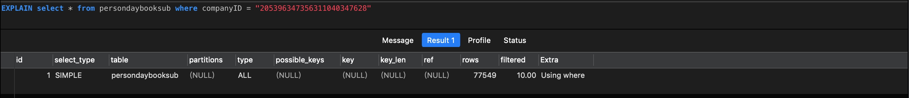
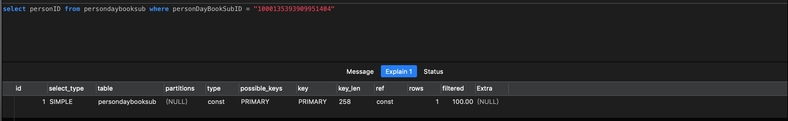
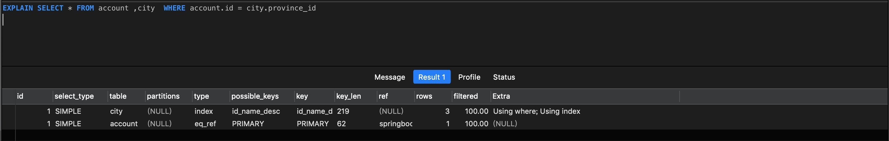
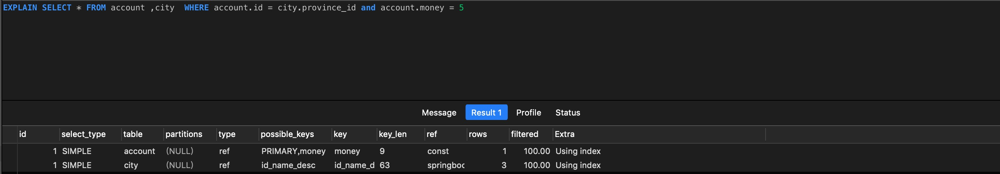
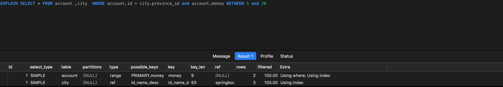
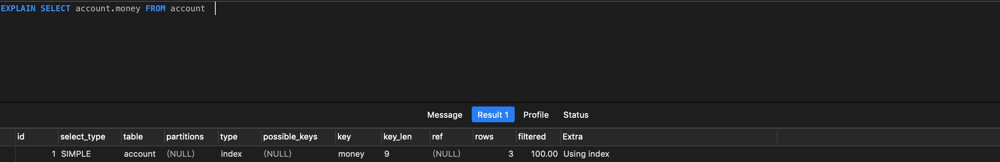

# SQL优化（mysql)

## 针对自身所缺乏的sql知识整理

1. 首先介绍一下`explain`,`explain`关键词用于展示某条`sql`语句是否展示了索引以及确认该`sql`语句是否必须进行优化。        `explain` 使用实例：      

关于`explain`的解释：   
- `table`表示查询的表。   
- `type`表示查询使用类型，性能从左到右依次递减 `system` -> `const` -> `eq_ref` -> `ref` -> `range` -> `index` -> `ALL`
在优化时至少达到`range`级别，最好可以达到`ref`。   
1). `system` 是 `const` 的特殊类型。 `const` 是针对主键或者唯一索引的查询,并且最多返回一条数据。    
 
2). `eq_ref` 经常出现在连表查询中，表示A表的每一个结果都只能与B表的单个结果匹配，查询条件通常使用 `=`。

3). `ref` 也是经常出现在连表查询中，针对非唯一索引(唯一索引列的所有值都只能出现一次，即必须唯一)，非主键索引，以及使用了最左前缀的索引查询。

4). `range`表示使用索引范围查询, 类似 `=, <>, >, >=, <, <=, IS NULL, <=>, BETWEEN, IN()` 操作。

5). `index` 表示全索引扫描, 和 `ALL` 类型类似, 但是 `index` 类型只扫描所有的索引。



2.索引的创建与使用。   

- 单列索引   
  
  节点中只有一个关键字，如在表 `city` 的 `name` 字段上加索引。
   
  ```java
     ALTER TABLE city ADD INDEX idx_city(`city_name`)
  ```
  
- 联合索引      
  
  节点中有多个关键字,如在表 `city` 的 `city_name`,`description` 两个字段上加索引。
  ```java
     CREATE INDEX idx_cityname_description ON `city`(`city_name`, `description`);
  ```

单列索引是特殊的联合索引

`EXPLAIN SELECT city.city_name, city.description FROM city  where city_name = "沈阳"`         
当且仅当联合索引`index（city_name_description)`存在并且使用 `city_name`查询时会用到索引（即匹配索引最左侧原则)，否则无法使用索引。    

- 联合索引列使用原则

   1.经常用的列优先 【最左匹配原则】

   2.选择性（离散度）高的列优先【离散度高原则】

   3.宽度小的列优先【最少空间原则】


3.数据库锁可以分为行锁，页锁，以及表锁。   
1). 行锁粒度最细，所以加锁慢，开销大，锁的性能最好,会出现死锁。   
2). 表锁粒度最粗，加锁块，开销小，锁的性能最差，不会出现死锁。   
3). 页锁开销和加锁时间界于表锁和行锁之间；会出现死锁；锁定粒度界于表锁和行锁之间，并发度一般。   

4. `mysql`共享锁与排他锁以及使用场景。 （数据库的增删改操作默认都会加排他锁，而查询不会加任何锁)       
- `mysql`共享锁`(lock in share mode)`。   
允许其它事务也增加共享锁读取。   
不允许其它事务增加排他锁`(for update)`。      
当事务之间同时增加共享锁的时候，事务之间的更新操作必须等待先执行的事务提交后才可以执行，如果并发大的情况下可能会造成死锁。   
使用场景：   
查询居多的情况
- `mysql` 排他锁`(for update)` 
当一个事务加入排他锁后，其他事务不能加共享锁或者排他锁读取或者更改数据。      
一次只能有一个排他锁执行commit，等到事务执行完成后其他事务才能执行。    
使用场景：   
写入居多，对吞吐要求不高，可使用悲观锁。   

   


   
   