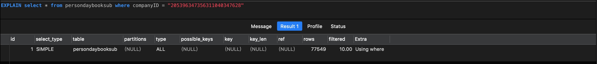
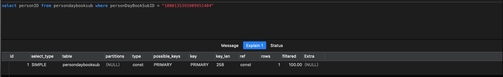
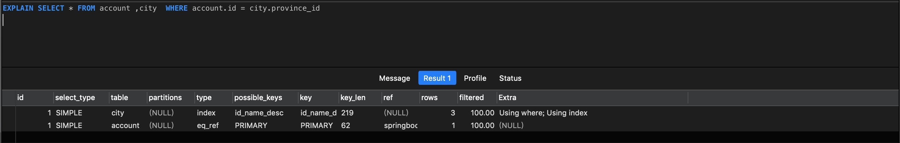
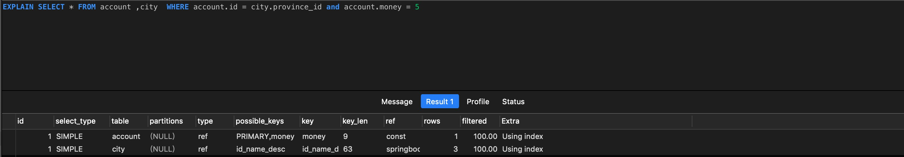
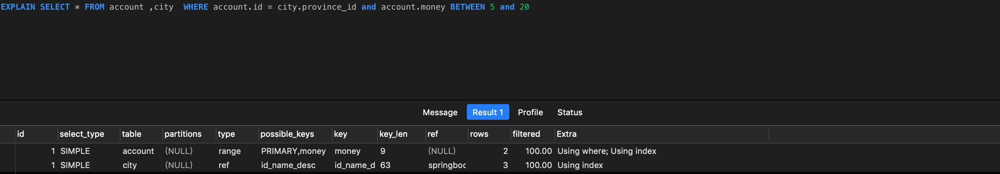
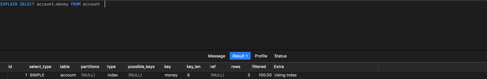

# SQL优化（mysql)

## 针对自身所缺乏的sql知识整理

1. 首先介绍一下`explain`,`explain`关键词用于展示某条`sql`语句是否展示了索引以及确认该`sql`语句是否必须进行优化。        `explain` 使用实例：      

关于`explain`的解释：   
- `table`表示查询的表。   
- `type`表示查询使用类型，性能从左到右依次递减 `system` -> `const` -> `eq_ref` -> `ref` -> `range` -> `index` -> `ALL`
在优化时至少达到`range`级别，最好可以达到`ref`。   
1). `system` 是 `const` 的特殊类型。 `const` 是针对主键或者唯一索引的查询,并且最多返回一条数据。    
 
2). `eq_ref` 经常出现在连表查询中，表示A表的每一个结果都只能与B表的单个结果匹配，查询条件通常使用 `=`。

3). `ref` 也是经常出现在连表查询中，针对非唯一索引(唯一索引列的所有值都只能出现一次，即必须唯一)，非主键索引，以及使用了最左前缀的索引查询。

4). `range`表示使用索引范围查询, 类似 `=, <>, >, >=, <, <=, IS NULL, <=>, BETWEEN, IN()` 操作。

5). `index` 表示全索引扫描, 和 `ALL` 类型类似, 但是 `index` 类型只扫描所有的索引。

2.查询时使用联合索引的一个字段能否使用到联合索引，举一个例子。   
`EXPLAIN SELECT city.city_name, city.description FROM city  where city_name = "沈阳"`      
当且仅当联合索引`index（city_name_description)`存在并且使用 `city_name`查询时会用到索引（即匹配索引最左侧原则)，否则无法使用索引。

