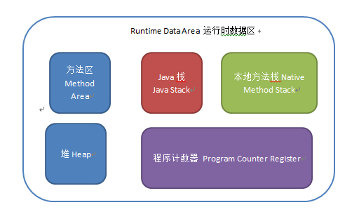

## Java 运行时数据区域
`Java`虚拟机所管理的内存包括如下图所示的几个运行时数据区域

### Java方法区
方法区是线程共享区域，用于存储已被虚拟机加载的类信息，常量，静态变量，以及编译器编译后的代码等数据。   

### Java栈
`Java` 栈分为两块，包含虚拟机栈和本地方法栈。   
#### 虚拟机栈是线程私有的，它的生命周期与线程相同，每个方法运行时都会创建一个栈帧，用于存储局部变量表，操作数栈，动态链接，方法出入口信息等，每个方法从调用直至执行完成的过程，就对应着一个栈帧从虚拟机中入栈到出栈的过程。   
其中局部变量表存放了8中基本类型数据，还有对象的引用。在`Java`虚拟机中对栈规定了两种异常情况，如果请求的栈的深度大于虚拟机所允许栈的深度，将抛出`StackOverflowError`异常，如果虚拟机可以动态扩展并且在扩展时无法申请足够的内存，那么将会抛出`OutOfMemoryError`异常。   
#### 本地方法栈
本地方法栈与虚拟机栈所发挥的作用类似，区别在于虚拟机栈为虚拟机执行`Java`方法服务， 本地方法栈为虚拟机执行`Native`方法服务。与虚拟机栈一样，本地方法栈也会抛出上面两种异常。