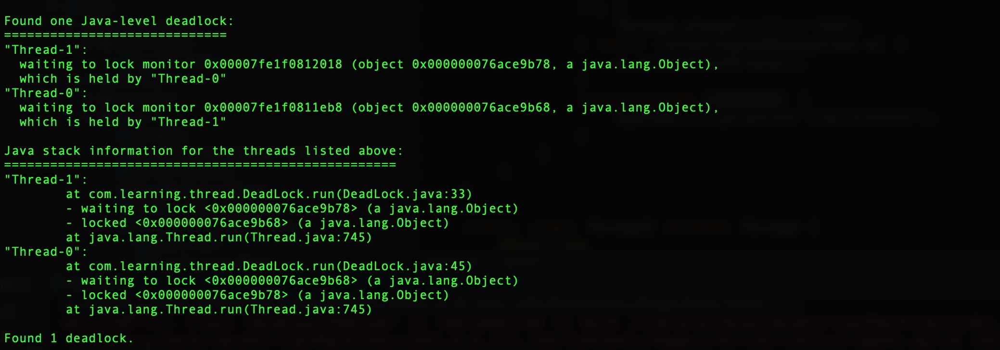

## JDK命令行工具
### 虚拟机进程状况工具jps

1). `jps -l` 输出主类的全名

2). `jps -v` 输出虚拟机进程启动时的JVM参数

### 虚拟机统计信息监控工具jstat
1). `jstat -gc` 监视Java堆的状况，包括Eden区，survivor区，老年代，永久代的容量，已用空间以及GC时间合计的信息。

2). `jstat -gcutil` 监视内容基本与-gc相同，单输出内容主要是使用空间占比。

### java堆栈跟踪工具jstack

1). `jstack -l` 除堆栈外，展示关于锁的附加信息。

